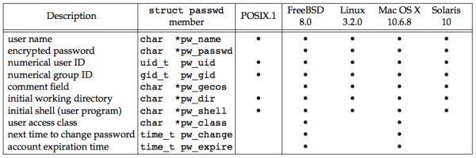
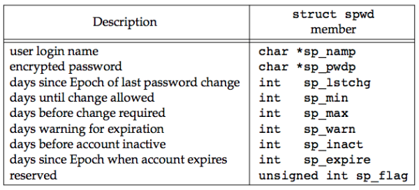

## Chapter 6. System Data Files and Information

This chapter covers portable interfaces to data files, system identification functions and the time and date functions.

### Password File

The UNIX System's password file, called the user database by POSIX.1, contains the following fields:

Historically, the password file has been stored in `/etc/passwd` and has been an ASCII file.

* `root` has a user ID of 0 (superuser)
* The encrypted password field contains a single character as a placeholder (`x`) 
* Some fields can be empty
* The shell field contains the user's login shell. The default value for an empty shell field is usually `/bin/sh`. Other executable that prevents a user from loggin in to a system:
    * `/dev/null`
    * `/bin/false`: exits with an unsuccessful (nonzero) status
    * `/bin/true`: exits with a successful (zero) status
    * `nologin`: prints a customizable error message and exits with a nonzero exit status
* `nobody` user name can be used to allow people to log in to a system, but with a user ID (65534) and group ID (65534) that provide no privileges.
* Some systems that provide the `finger(1)` command support additional information in the comment field

Some systems provide the `vipw` command to allow administrators to edit the password file.

* `getpwuid`: used by the `ls(1)` program to map the numerical user ID contained in an i-node into a user's login name.
* `getpwnam`: used by the `login(1)` program when we enter our login name

* `getpwent`: returns the next entry (a pointer to a structure that it has filled in, this structure is overwritten each time we call this function) in the password file.
* `setpwent`: rewinds files
* `endpwent`: closes files

Example:

* [getpwnam.c](https://github.com/shichao-an/apue.3e/blob/master/datafiles/getpwnam.c)

`setpwent` at the beginning of this function is self-defense: we ensure that the files are rewound, in case the caller has already opened them by calling getpwent.

### Shadow Passwords

Systems store the encrypted password in another file, often called the **shadow password file**. Minimally, this file has to contain the user name and the encrypted password.

The shadow password file should not be readable by the world. Only a few programs need to access encrypted passwords, e.g. `login(1)` and `passwd(1)`, and these programs are often set-user-ID root. With shadow passwords, the regular password file, `/etc/passwd`, can be left readable by the world.

