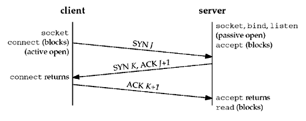
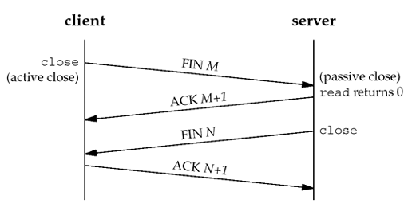

## Chapter 2. The Transport Layer: TCP, UDP, and SCTP

### Introduction

This chapter focuses on the transport layer: TCP, UDP, and Stream Control Transmission Protocol (SCTP). UDP is a simple, unreliable datagram protocol, while TCP is a sophisticated, reliable byte-stream protocol. SCTP is similar to TCP as a reliable transport protocol, but it also provides message boundaries, transport-level support for multihoming, and a way to minimize head-of-line blocking.

### The Big Picture 

Overview of TCP/IP protocols:

Protocol | Description
-------- | -----------
IPv4 | Internet Protocol version 4. IPv4 uses 32-bit addresses and provides packet delivery service for TCP, UDP, SCTP, ICMP, and IGMP.
IPv6 | Internet Protocol version 6. IPv6 uses 128-bit addresses.
TCP | Transmission Control Protocol. TCP is a connection-oriented protocol that provides a reliable, full-duplex byte stream to its users
UDP | User Datagram Protocol. UDP is a connectionless protocol, and UDP sockets are an example of datagram sockets.
SCTP | Stream Control Transmission Protocol. SCTP is a connection-oriented protocol that provides a reliable full-duplex association
ICMP | Internet Control Message Protocol. ICMP handles error and control information between routers and hosts.
IGMP | Internet Group Management Protocol. IGMP is used with multicasting.
ARP | Address Resolution Protocol. ARP maps an IPv4 address into a hardware address (such as an Ethernet address). ARP is normally used on broadcast networks such as Ethernet, [token ring](http://en.wikipedia.org/wiki/Token_ring), and [FDDI](http://en.wikipedia.org/wiki/Fiber_Distributed_Data_Interface), and is not needed on point-to-point networks.
RARP | Reverse Address Resolution Protocol. RARP maps a hardware address into an IPv4 address. It is sometimes used when a diskless node is booting.
ICMPv6 | Internet Control Message Protocol version 6. ICMPv6 combines the functionality of ICMPv4, IGMP, and ARP.
BPF | [BSD packet filter](http://en.wikipedia.org/wiki/PF_(firewall)). This interface provides access to the datalink layer. It is normally found on Berkeley-derived kernels.
DLPI | [Datalink provider interface](http://en.wikipedia.org/wiki/Data_Link_Provider_Interface). 

### User Datagram Protocol (UDP)

* Lack of reliability
* Each UDP datagram has a length
* **Connectionless** service

### Transmission Control Protocol (TCP)

* **Connection**: TCP provides connections between clients and servers. A TCP client establishes a connection with a server, exchanges data across the connection, and then terminates the connection.
* **Reliability**: TCP requires acknowledgment when sending data. If an acknowledgment is not received, TCP automatically retransmits the data and waits a longer amount of time.
* **Round-trip time** (RTT): TCP estimates RTT between a client and server dynamically so that it knows how long to wait for an acknowledgment.
* **Sequencing**: TCP associates a sequence number with every byte (**segment**, unit of data that TCP passes to IP.) it sends. TCP reorders out-of-order segments and discards duplicate segments.
* **Flow control**
* **Full-duplex**: an application can send and receive data in both directions on a given connection at any time.

### Stream Control Transmission Protocol (SCTP)

Like TCP, SCTP provides reliability, sequencing, flow control, and full-duplex data transfer.

Unlike TCP, SCTP provides:

* **Association** instead of "connection": An association refers to a communication between two systems, which may involve more than two addresses due to multihoming.
* **Message-oriented**: provides sequenced delivery of individual records. Like UDP, the length of a record written by the sender is passed to the receiving application.
* **Multihoming**: allows a single SCTP endpoint to support multiple IP addresses. This feature can provide increased robustness against network failure.

### TCP Connection Establishment and Termination

#### Three-Way Handshake

1. Server: **passive open**, by calling `socket`, `bind`, and `listen`
2. Client: **active open**, by calling `connect`. The client TCP to send a "synchronize" (SYN) segment with no data but it contains client's initial sequence number for the data to be sent on the connection.
3. Server: acknowledges (ACK) client's SYN. The server sends its SYN and the ACK of the client's SYN in a single segment which also contains its own SYN containing the initial sequence number for the data to be sent on the connection.
4. Client: acknowledges the server's SYN.

The client's initial sequence number as *J* and the server's initial sequence number as *K*. The acknowledgment number in an ACK is the next expected sequence number for the end sending the ACK. Since a SYN occupies one byte of the sequence number space, the acknowledgment number in the ACK of each SYN is the initial sequence number plus one.

#### TCP Options

* MSS option. The TCP sending the SYN announces its **maximum segment size** (the maximum amount of data that it is willing to accept in each TCP segment)on this connection.
* Window scale option. [p38]
* Timestamp option

#### TCP Connection Termination

It takes four segments to terminate a connection:

1. One end calls `close` first by sending a FIN segment to mean it is finished sending data. This is called **active close**.
2. The other end that receives the FIN performs the **passive close**. The received FIN is acknowledged by TCP (sending an ACK segment). The receipt of the FIN is also passed to the application as an end-of-file.
3. Sometime later, the application that received the end-of-file will close its socket. This causes its TCP to send a FIN.
4. The TCP on the system that receives this final FIN (the end that did the active close) acknowledges the FIN

A FIN occupies one byte of sequence number space just like a SYN. Therefore, the ACK of each FIN is the sequence number of the FIN plus one.

#### TCP State Transition Diagram

There are 11 different states defined for a connection and the rules of TCP dictate the transitions from one state to another, based on the current state and the segment received in that state.

#### Watching the Packets

The client in this example announces an MSS of 536 (**minimum reassembly buffer size**) and the server announces an MSS of 1,460 (typical for IPv4 on an Ethernet). It is okay for the MSS to be different in each direction.
